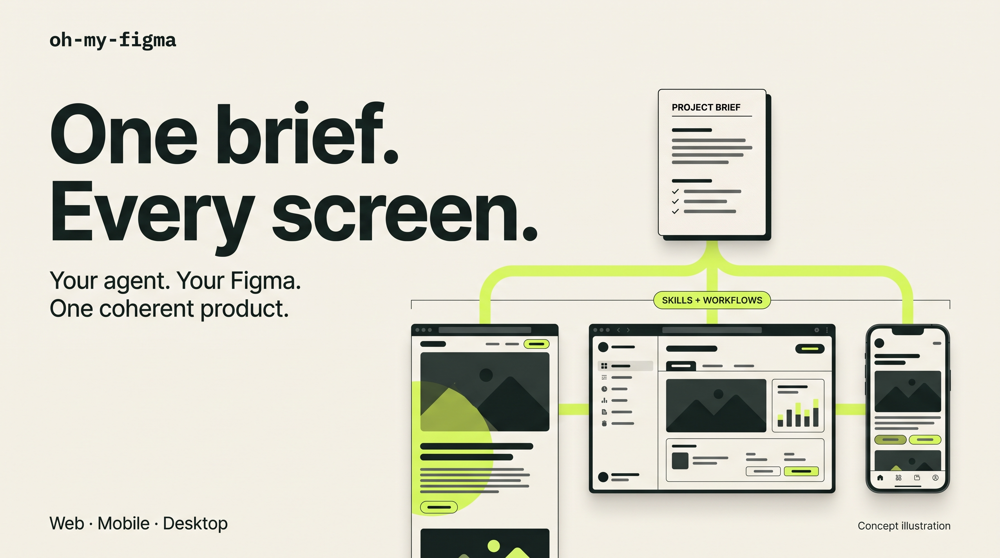
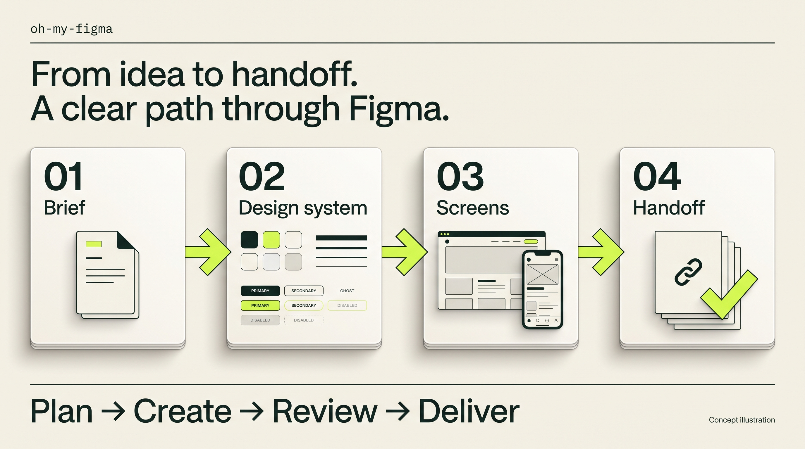
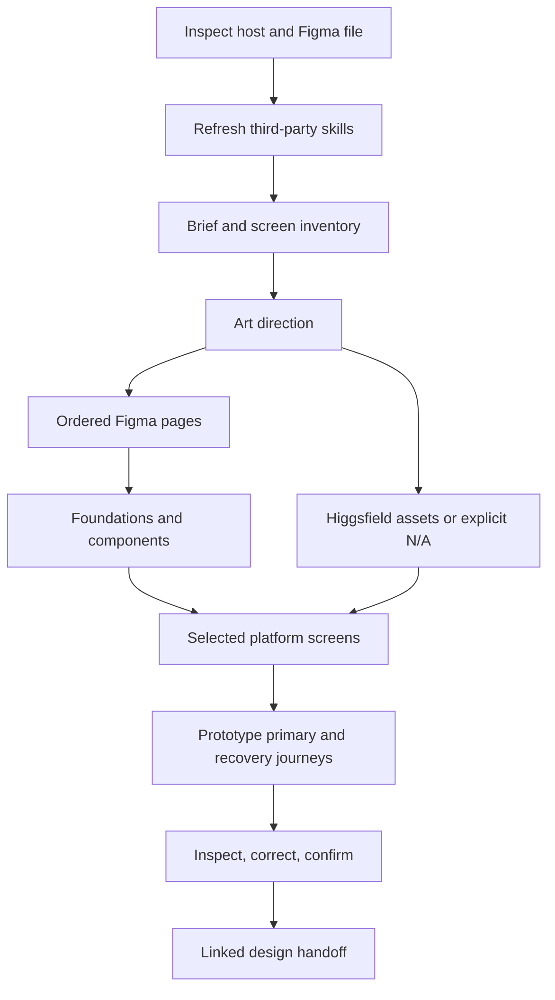

<p align="center">
  
</p>

<h1 align="center">oh-my-figma</h1>
<p align="center"><strong>Give your agent a brief. Get a whole product design in Figma.</strong></p>
<p align="center">
  <a href="#install-in-codex">Install in Codex</a> ·
  <a href="#use-in-chatgpt">Use in ChatGPT</a> ·
  <a href="#what-the-workflow-does">How it works</a> ·
  <a href="https://github.com/Mukhsin0508/oh-my-figma/releases/latest">Download</a>
</p>
<p align="center">
  <a href="LICENSE"></a>
  
  <a href="https://github.com/Mukhsin0508/oh-my-figma/actions/workflows/check.yml"></a>
</p>

Your landing page, web app, phone screens and desktop app should feel like **one product**. Oh My Figma gives ChatGPT or Codex a reusable path from the brief to the design system, screens, prototype and handoff.

- **One visual language:** shared foundations and components across seven platform playbooks.
- **A file you can navigate:** ordered pages, named screens, states and linked journeys.
- **A workflow you can resume:** recorded progress, Higgsfield asset jobs and review evidence.

Works through the Figma web app or authorized plugin tools. Bring Higgsfield for imagery and current Impeccable guidance for design craft. Third-party skills are refreshed through their supported routes on each new or resumed session.

## Install in Codex

```sh
npx skills@latest add Mukhsin0508/oh-my-figma --skill oh-my-figma --agent codex
```

Add `--global` for a user-wide install. The entire skill is self-contained; its references, platform playbooks, graph and optional Node helper travel with it.

Then ask:

> Use $oh-my-figma in the Figma web app to design a creator workspace. Include a landing page, web app, iOS, Android, macOS and Windows. Use Higgsfield for original hero and onboarding imagery. Build the create → review → export journey, including empty/error states, and deliver the Figma file and working prototype links.

Connect Figma/Higgsfield through your host's plugin controls. Installation of a skill does not connect accounts, install companion plugins or change your selected model.

## Use in ChatGPT

Use **Plugins → Skills → Create → Upload from your computer**, when skill upload is available for your account/workspace. Export the same skill with:

```sh
npx --yes --package=github:Mukhsin0508/oh-my-figma oh-my-figma bundle oh-my-figma.zip
```

Upload `oh-my-figma.zip`, enable the needed Figma/Higgsfield tools, and ask it to use the Figma web app. If the host has no Node shell, the agent follows the same graph using a saved task artifact. `npx` prepares the ZIP; it does not install into ChatGPT's web UI. An ordinary file attached to a conversation is not necessarily an installed skill. [Official ChatGPT Skills documentation](https://help.openai.com/en/articles/20001066-skills-in-chatgpt/).

## What the workflow does



<sub>Generated concept illustrations by Higgsfield. These explain the intended workflow; they are not screenshots of a completed design run. [Media kit and prompts](docs/media/README.md).</sub>

<details>
<summary>See the complete workflow graph</summary>



</details>

Each platform is its own graph node. The host selects only requested surfaces, keeps one Figma writer and records evidence before completing a node. Resuming does not recreate finished frames or resubmit paid generations.

| Platform | Designed output |
|---|---|
| Landing | Wide/narrow compositions, conversion path and form states |
| Web | Workspace, primary task, detail/results, settings and recovery |
| iOS / Android | Native navigation, keyboard/permission states and device-aware flows |
| macOS / Windows | Desktop workspace, window resizing, menus, keyboard and dialogs |
| OS concept | Shell, launcher, window management, notifications and session states |

## Figma page order

`00 Start here` → `01 Brief & journeys` → `02 Art direction` → `03 Foundations` → `04 Components` → `05 Assets` → selected platform pages (`10 Landing`, `20 Web`, `30 iOS`, `31 Android`, `40 macOS`, `41 Windows`, `50 OS`) → `80 Prototypes` → `90 Handoff`.

Screens belong in journey sections inside platform pages. State/device variations stay beside their parent screen. Create only needed pages; preserve existing team conventions and unrelated work. [Detailed organization rules](skills/oh-my-figma/references/file-organization.md).

## Always resolve current third-party skills

No third-party skill is vendored or pinned into this package. Every new/resumed host session checks official upstream, updates using the supported installer/plugin manager, rereads current instructions, and records a version/commit or managed-channel receipt. Missing freshness proof blocks dependent execution instead of silently using stale instructions.

- **Impeccable:** official upstream and supported current installer/update route.
- **Figma/Higgsfield:** current host-managed plugins, prerequisite skills and live tool schemas.
- **No model pinning:** the selected ChatGPT/Codex model runs the workflow; access to Astra or any other model is independent.

The skill directs freshness checks; the local helper verifies receipt structure, not plugin-store state. A host that cannot update or verify a plugin needs user/administrator action. See [freshness procedure](skills/oh-my-figma/references/dependencies.md) and [integration routing](skills/oh-my-figma/references/integrations.md).

## Optional local graph helper

Run via GitHub without an npm-registry publication:

```sh
npx --yes --package=github:Mukhsin0508/oh-my-figma oh-my-figma plan .oh-my-figma/run.json landing,web,ios,windows
npx --yes --package=github:Mukhsin0508/oh-my-figma oh-my-figma next .oh-my-figma/run.json
```

Or clone the repository and use `node bin/oh-my-figma.mjs`. Commands:

| Command | Behavior |
|---|---|
| `validate` | Check graph references, IDs, dependencies and cycles |
| `graph` | Print the complete JSON graph |
| `plan <run.json> <surfaces>` | Create a scoped run; refuse overwrite |
| `next <run.json>` | Show ready nodes, blockers and completion state |
| `record <run.json> <node> <evidence.json>` | Validate and record the agent's completion evidence |
| `block <run.json> <node> "reason"` | Record a ready node's blocker |
| `retry <run.json> <node>` | Reopen blocked work within the attempt budget |
| `bundle <output.zip>` | Export the standalone skill; refuse overwrite |

The helper makes **no network requests** and **does not execute design tools**. Evidence is an agent attestation; it cannot authenticate screenshots, external file IDs or results. [Execution and evidence format](skills/oh-my-figma/references/execution.md).

## Project status

**v0.1 is an installable skill package and local graph helper.** Installation, packaging and scheduler behavior are tested. Live Figma/Higgsfield design execution still needs its first end-to-end validation. The deliverables are designs and prototypes, not deployed websites or compiled applications.

## Develop and verify

Node 20+; no runtime dependencies.

```sh
npm run check
npm test
npm run bundle
npm pack --dry-run
```

Tests cover all platform subsets, dependency order, cycle rejection, evidence requirements, freshness receipts, blockers, retry limits, relocation and ZIP integrity. The CI matrix targets Linux, macOS and Windows on Node 20/22. [Validation scope and live acceptance scenarios](docs/validation.md).

## Sources and inspiration

Original instructions and local helper code, informed by [MoneyPrinterTurbo](https://github.com/harry0703/MoneyPrinterTurbo), [ShortGPT](https://github.com/RayVentura/ShortGPT), [dream-loop](https://github.com/achimala/dream-loop), [fable-orchestrator](https://github.com/codejunkie99/fable-orchestrator), and [gstack](https://github.com/garrytan/gstack). Companion [Impeccable](https://github.com/pbakaus/impeccable) remains separately installed and maintained. We do not redistribute their skills, code or tool schemas. Figma, Higgsfield and OpenAI are independent products; this project is not an official integration maintained by those companies.

MIT licensed.
